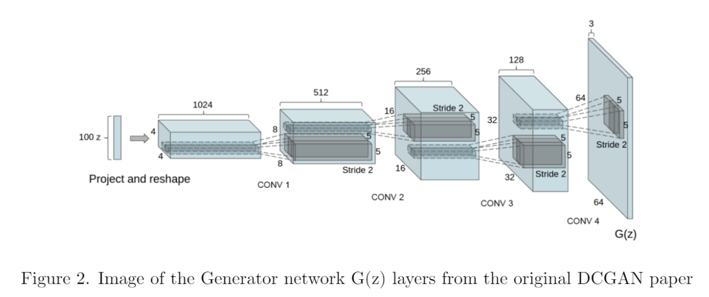
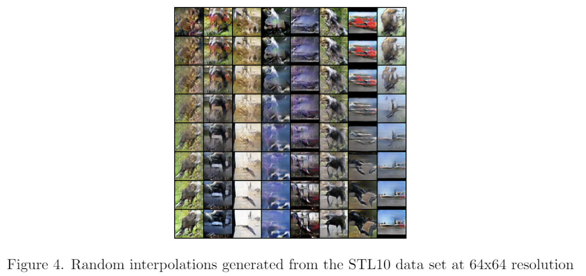
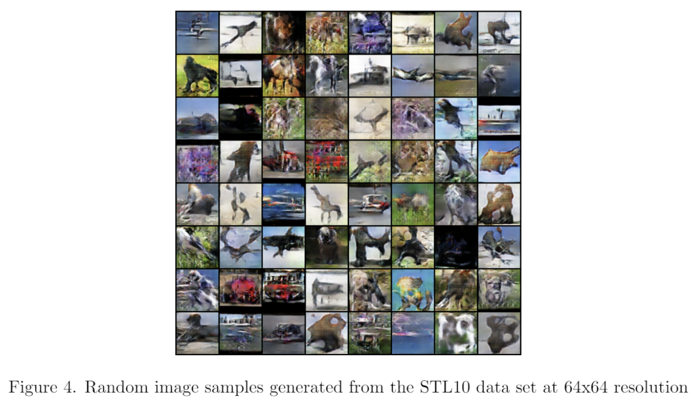

# Using a DCGAN to generate Images
## Trained on CIFAR-10 and STL-10 datasets at varying resolutions

This repository contains a detailed report on how the deep learning was implemented. It also includes the .py file used for the project. Needed more training time to get good results! But my Colab credits ran out.

